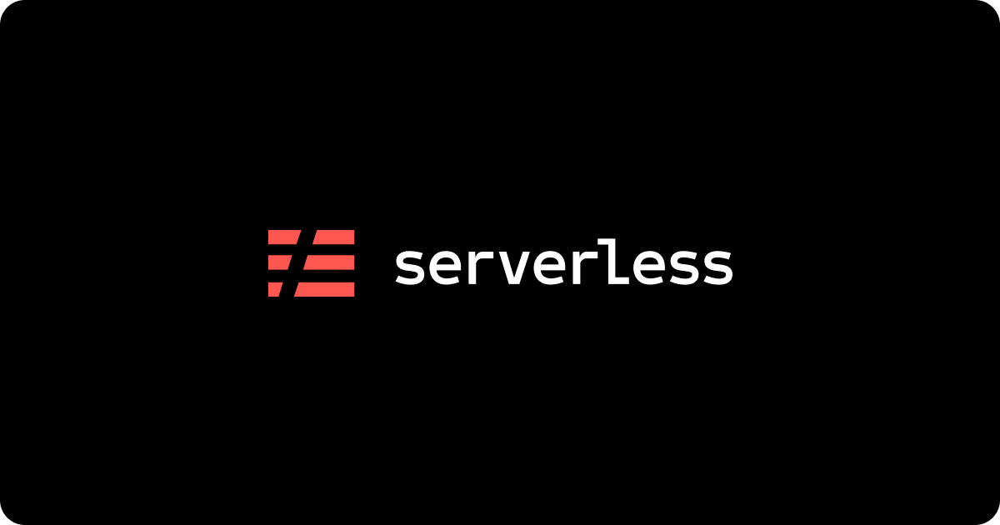
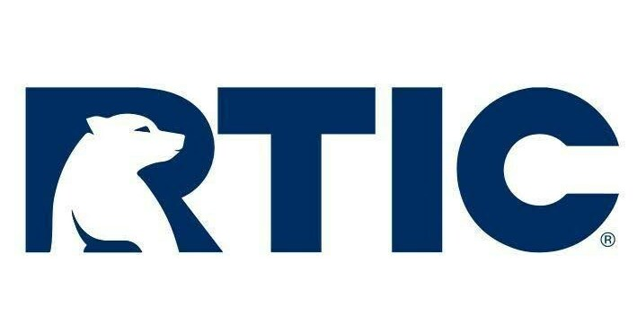
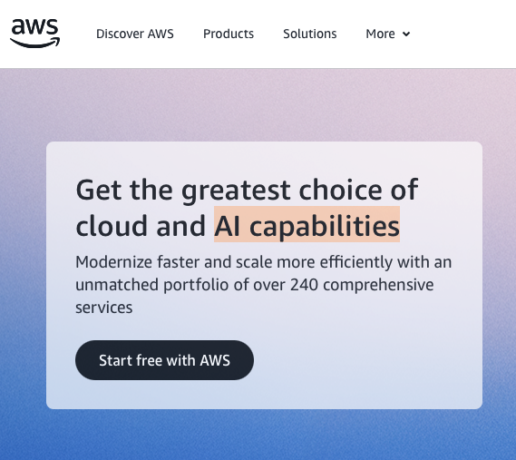
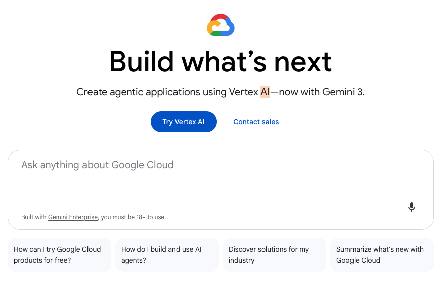
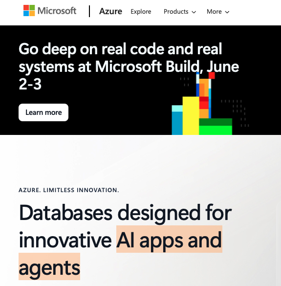
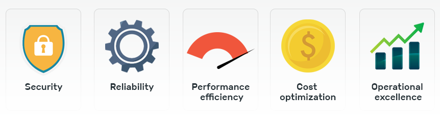
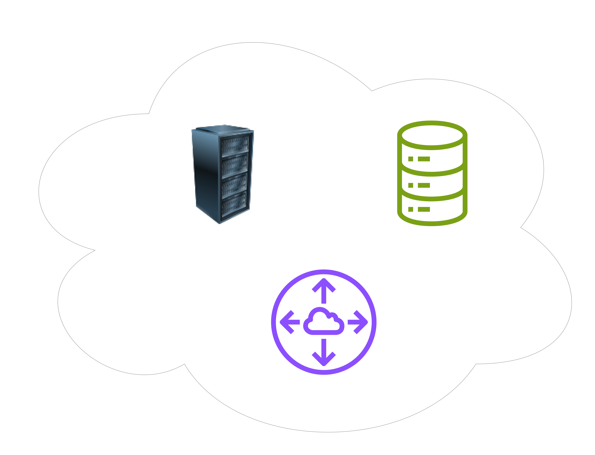
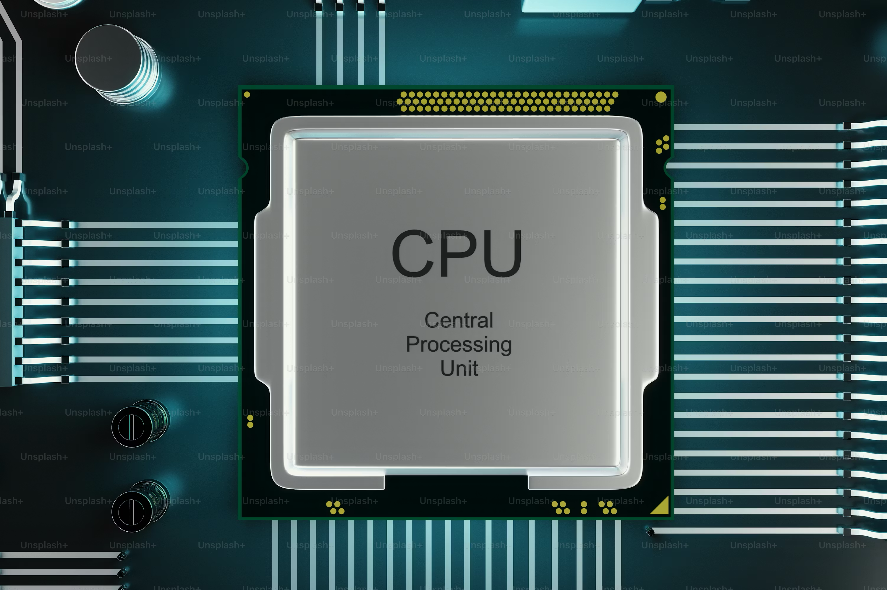

Selçuk Cihan
---

* Boğaziçi Üniversitesi Bilgisayar Mühendisliği (2008)
* AirTies
* Ziraat Teknoloji
* Intertech
* Amazon
* Tellimer
* Serverless Inc.
* RTIC Outdoors

<!-- new_lines: 2 -->

<!-- column_layout: [1, 1, 1] -->
<!-- column: 0 -->

<!-- column: 1 -->

<!-- column: 2 -->

<!-- reset_layout -->
<!-- end_slide -->

<!-- end_slide -->

<!-- end_slide -->

<!-- end_slide -->

Mühendislik 📐
---

## "Every engineering decision is a buying decision" - Erik Peterson (CloudZero)

Verdiğimiz her karar, seçtiğimiz her yöntem aslında bir satın alma kararı.

* Mühendislik = **OPTİMİZASYON**
* Oynadığımız her değişkenin neticeye etkileri var.
* Ne kadar bilinçli kararlar verirsek, hedefe o kadar yaklaşırız.

<!-- reset_layout -->
<!-- end_slide -->

Uygulamaların İhtiyaçları
---

Yazdığımız uygulamaların gereksinimleri ve uyması gereken kısıtlar vardır;

## Maliyet
## Performans
## Kapasite
## Güvenlik
## Yedekleme
## Hizmet sürekliliği
## Bakım/onarım
## Disaster recovery

<!-- end_slide -->

Cloud ☁️ Nedir?
---

<!-- column_layout: [2, 2] -->
<!-- column: 0 -->

<!-- column: 1 -->
## Bir başkasının bilgisayarı

### Yönetmek zorunda olmadığımız
### Gözden ırak, gönülden de ırak :)
### Hesaplı

## Bulut, hangi problemi çözüyor?

### Maliyetleri azaltmaya yarıyor

1. Veri merkezi kurmaya gerek yok
2. Uzun vadeli kiralamalara gerek yok
3. İhtiyaç duyduğun an, ihtiyaç duyduğun kadar kapasite alabiliyorsun
4. Bakım ve onarım işleri bu işte uzman kişilerce hallediliyor

<!-- reset_layout -->
<!-- end_slide -->

Bulut Hizmeti Sunan Firmalar
---

<!-- column_layout: [2, 2] -->
<!-- column: 0 -->

## Devler Ligi
* Amazon (AWS), Google GCP, Microsoft Azure, Oracle, IBM, SAP...

## Startup
* Clouflare, Netlify, Vercel, Replit...

Bunlar public cloud hizmeti sunan firmalardan bazılarıydı.

## Private: Kendi veri merkeziniz varsa
* Ziraat Bankası tüm uygulamalarını kendi sunucularında barındırıyor

## Hybrid
* THY bir kısım uygulama ve veriyi kendi veri merkezinde tutarken, bazı uygulamaları public cloud üzerinde çalıştırıyor

<!-- column: 1 -->

<!-- reset_layout -->
<!-- end_slide -->

Bulut Mimarisi
---

Bir uygulamam var, bunu yayına almak istiyorum.

İster kendi bilgisayarımda çalışsın, ister cloud'da, bana gerekenler:

- **işlem** gücü
- memory
- **depolama** alanı
- diğer uygulamalara ve istemcilere bağlanabilmek için **network**

## İstemci (müşteri gibi düşünün) - Sunucu (bulut)

Bulut sunucu tarafındaki veri

* depolama
* işleme
* sunma

ihtiyaçlarımızı karşılıyor.

<!-- end_slide -->

Temel Bileşenler
---

<!-- column_layout: [3, 2] -->
<!-- column: 0 -->
## İşlem gücü
* Fiziksel sunucu kiralama
* Sanal makina kiralama
* On-demand compute, serverless

<!-- column: 1 -->

<!-- reset_layout -->

<!-- column_layout: [4, 2] -->
<!-- column: 0 -->
## Depolama
* SQL/NoSQL veritabanları
* Nesne (object) veya key-value store
* Message queue (kuyruk)
* Message stream (mesela uber'den gelen konum bilgisi)
* Search engines (elastic)

<!-- column: 1 -->

<!-- reset_layout -->

<!-- column_layout: [3, 2] -->
<!-- column: 0 -->
## Ağ
* Load balancer
* API Gateway
* CDN
* DNS
* VPN
* Firewall

<!-- column: 1 -->

<!-- reset_layout -->

<!-- end_slide -->

Özelleşmiş Hizmetler
---

Temel bileşenler haricind

Bulut sağlayıcılar, sık tekrar eden problemler için özelleşmiş çözümler sunuyor.

* Event bus
* Kubernetes
* Container services
* Auto scaling
* User/identity management
* Text to speech
* LLM text generation
* Image, video generation
* Code generation

<!-- end_slide -->
